# Procesverslag

Markdown is een simpele manier om HTML te schrijven.  
Markdown cheat cheet: [Hulp bij het schrijven van Markdown](https://github.com/adam-p/markdown-here/wiki/Markdown-Cheatsheet).

Nb. De standaardstructuur en de spartaanse opmaak van de README.md zijn helemaal prima. Het gaat om de inhoud van je procesverslag. Besteedt de tijd voor pracht en praal aan je website.

Nb. Door _open_ toe te voegen aan een _details_ element kun je deze standaard open zetten. Fijn om dat steeds voor de relevante stuk(ken) te doen.

## Jij

  
uitwerken voor kick-off werkgroep

### Auteur:

Thijs Dekker

#### Je startniveau:

Rode piste

#### Je focus:

Surface plane

## Je website

  
uitwerken voor kick-off werkgroep

### Je opdracht:

https://www.porsche.com/netherlands/nl/

#### Screenshot(s) van de eerste pagina (small screen):

Porsche Netherlands - Home
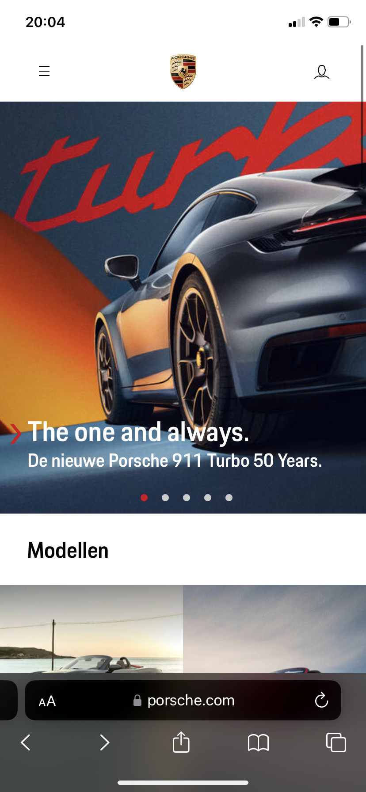

#### Screenshot(s) van de tweede pagina (small screen):

Porsche 911 overzicht pagina
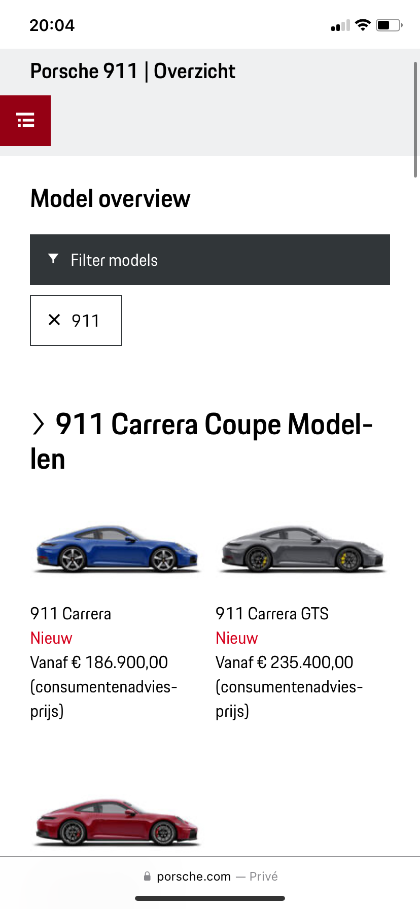

## Toegankelijkheidstest 1/2 (week 1)

  
uitwerken na test in 2e werkgroep

### Bevindingen

ELASTIEKJES en SCHOK APPERAAT

Ik begon met de elastiekjes om mijn vingers , ik had ze op willekeurige volgorde om mijn vingers geknoopt en merkte al snel dat om te scrollen je 2 vingers nodig hebt op macbook, en mijn vingers konden niet echt lekker naast elkaar , dus vaak klikte ik verkeerde dingen aan of swipde ik het perongeluk weg. Vooral het perongeluk op dingen klikken gebeurde vaak omdat ik niet goed kon klikken. Wel vond ik de website ruim opgezet en als het lukte om te klikken klikte je dus wel raak. Maar ik kon wel goed de website navigeren .
Vervolgens heb ik de parkenson simulator op mijn arm toegevoegd , dit viel erg tegen aangezien ik bijna niet in staat was om te typen, gelukkig zijn er niet echt dingen waar je moet typen, alles is goed bereikbaar door de navigatie menu's.

VOICE OVER

De voice over functie werkt goed , de tekst en knoppen worden verteld. Ook de foto's van de auto's en de preciese kleur ervan wordt met de gebruiker gecommuniceerd. Alleen probeerde ik op het kruisje in de hoek te klikken en hier kon ik alleen met mijn muis naartoe navigeren omdat de voice over het kruisje oversloeg. Ook is de carrousel die zich in het home scherm bevind erg moeilijk te navigeren omdat er niet echt knoppen ofzo zitten maar alleen rode bolletjes dus ik zou als blind iemand niet echt weten wat ik daar moest doen.

## Breakdownschets (week 1)

  
uitwerken na afloop 3e werkgroep

### de hele pagina:

  

### dynamisch deel (bijv menu):

  

### wellicht nog een dynamisch deel (bijv filter):

  

## Voortgang 1 (week 2)

  
uitwerken voor 1e voortgang

### Stand van zaken

Bij het opbouwen van de website in html wist ik soms niet of ik UL/LI moest gebruiken of dat ik van bijvoorbeeld een foto collage articles moest maken.

### Agenda voor meeting

samen met je groepje opstellen

| student 1      | student 2          | student 3    | student 4 |
| -------------- | ------------------ | ------------ | --------- |
| dit bespreken  | en dit             | en ik dit    |           |
| en dat ook nog | dit als er tijd is | nog een punt |           |
| ...            | ...                | ...          |           |

Student (thijs) 1: Ik ind het nog moeilijk wanneer ik unordered lists of juist articles moet maken.

Ook heb ik zoveel sections en UL's dat ik niet echt goed weet hoe ik nu een bepaalde ul en Li aanspreek

Moet alles werken? dus elke knop en uitschuif balk etc.

Hoe blijft mijn tekst onder een carrousel?

Student 2:

Student 3:

Student 4:

### Verslag van meeting

- punt 1: Het is nu duidelijk wanneer ik een lijst moet gebruiken op mijn website, op veel plekken waar ik articles had gebruikt had ik beter UL/LI's kunnen gebruiken
- punt 2: Door bijvoorbeeld section ul li:first child / nth-child(2) te doen kun je gemakkelijk bepaalde UL's en LI slecteren
- punt 3: Als ik bepaalde dingen laat werken zal dat natuurlijk meewerken aan mijn surface plane design
- punt 4: ik heb nu een website waar ik gemakkelijk de carrousel kan maken.

## Voortgang 2 (week 3)

  
uitwerken voor 2e voortgang

### Stand van zaken

Alle HTML staat erin en en ik ben begonnen met de basis van de caroussel en de rest van de website. Ik vind het nog lastig om tekst in afbeeldingen te krijgen of buttons bijvoorbeeld.
De tweede pagina staat alle html erin.

### Agenda voor meeting

Mijn punten:
1 2 paginas css of 1?
2 1 java of 2?
3 Hoe krijg ik bepaalde iconen?

### Verslag van meeting

we mogen maar 1 css bestand , je moet dus specifiek zijn met de aanroepingen van bepaalde elementen zodat je niet ook die op de andere pagina pakt.
Hetzelfde geld voor javascript, we mogen maar 1 javascript pagina en dus wees hier ook specifike in en stel bijvoorbeeld codes die checken of bepaalde elementen wel aanwezig zijn

## Toegankelijkheidstest 2/2 (week 4)

  
uitwerken na test in 9e werkgroep

### Bevindingen

VOICE OVER: De voice over tekst ging goed , alle auto's en knoppen worden opgelezen. Ook zitten er redelijke duidelijke ALTS die de autos en de kleuren beschrijven. De voice over heeft een duidelijke structuur door de pagina heen en gaat begint bij de header en beweegt dan naar beneden. Ook is de carrousel duidelijekr dan de eerste keer aangezien je nu buttons hoort dus weet dat je ergens op kan klikken.

ELASTIEKJES: ik kon nu op de buttons klikken , ook vegen was te doen maar de buttons was makkelijker om met mijn vingers te raken

## Voortgang 3 (week 4)

  
uitwerken voor 3e voortgang

### Stand van zaken

html en css is zo goed als af, alleen weet ik niet of je een class op de body mag zetten aangezien mijn tweede pagina nu gestyled wordt door de eerste style css. Ook moet ik nog van alle dingen die in de echte website een link zijn, een ahref omheen zetten. Ook moet ik nog enkele dingen op de css van mijn 2de pagina fixen , zoals de benzine gedeelte

### Agenda voor meeting

Vragen:
Mag je class op de body?
Hoe kan ik in het geval van dat dat niet onderscheid maken tussen de sections.
Moet ik overal ahrefs omheen doen

### Verslag van meeting

hier na afloop snel de uitkomsten van de meeting vastleggen

Er mag geen class op de body , omdat wanneer je veel paginas gaat maken en je bijvoorbeeld herhalingselementen hebt dit onhandig is als er dan een class op de body. Ik ga dus de sections koppelen aan een class , en zo kan ik dus ook bepaalde elemetnen hergebruiken.

Ik moet inderdaad a hrefs om alles heen zetten wat klikbaar is en geen button( wat je naar een andere pagina brengt). Dit kost niet super veel werk , ik moet nu alleen de a text decoration uitzetten.

## Eindgesprek (week 5)

  
uitwerken voor eindgesprek

SURFACE PLANE PUNTEN:

1. schakelen tussen taycan model
2. stop knopje voor video
3. Halloween 911
4. geluid knop GT3RS
5. DARK/LIGHT mode
6. custom properties
7. Bekijk prijs andere indeling

MICRO INTERACTIE

1. CARROUSEL vannuit java

### Je uitkomst - karakteristiek screenshots:

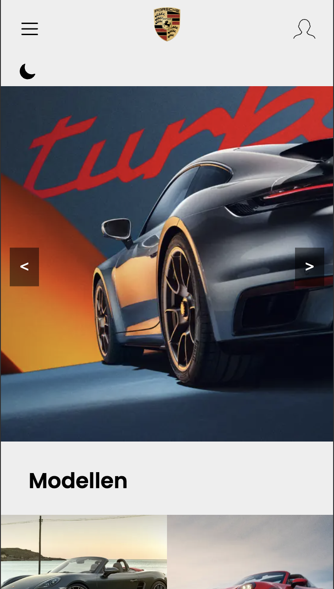
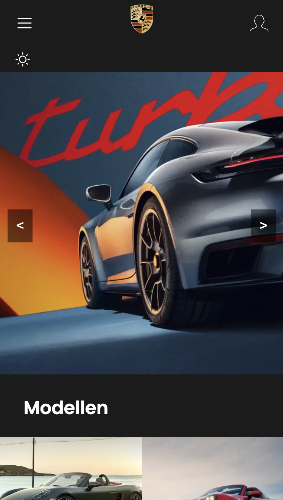
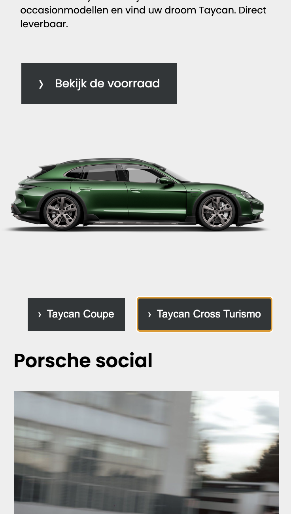
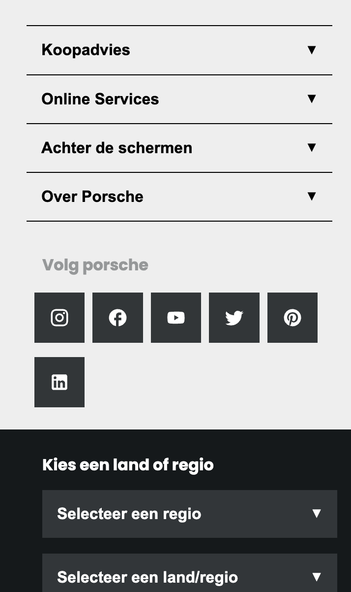
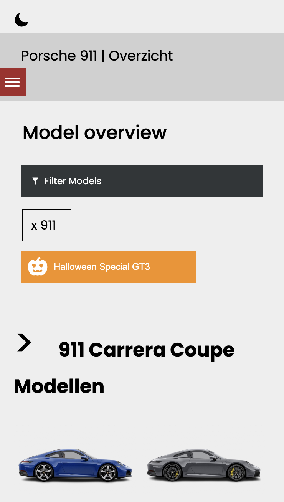
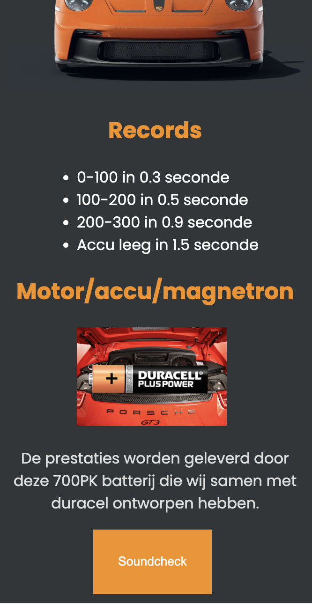
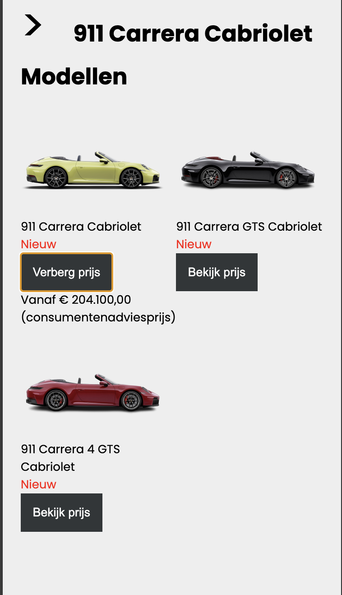

### Dit ging goed/Heb ik geleerd:

In het begin vond ik een carrousel onwijs onoverzichtelijk en ook bij de voorbeelden die ik kreeg van studentenassistenten of van css websites vond ik het erg lastig om een begrip te krijgen van wat ik noi eigenlijk moet doen , door verschillende carrousels helemaal uit elkaar te halen en kijken naar wat wat precies doet heb ik erg veel geleerd. In deze fase heb ik ook veel voorbeelden in chat gpt gezet en gevraagd of het stap voor stap goed uitgelegd kon worden, dit kostte erg veel tijd maar het liet mij wel snappen wat ik nou daadwerkelijk aan het doen was. Ook ben ik erachter gekomen dat coderen veel meer is dan alleen code weten en snappen , het vereist ook dat je erg goed bent in probleem oplossend denken en logisch nadenken. veel problemen die ik ben tegengekomen tijdens het coderen waren simpelweg op te lossen door stap voor stap terug te werken en kijken waar het nou precies fout gaat. Ik heb het idee dat ik door dit project daarom een beter inzicht heb gekrgeen in hoe het coderen werkt en hoe je problemen kan oplossen. Ook een belangerijke die ik heb geleerd, je moet wel eerst snappen wat je doet voor je iets googled anders kom je in een tuturial loop. Ik heb veel tutorials gekeken en op veel websites naar oplossingen gezocht, maar soms voor problemen die ik eigenlijk nog niet echt snapte, het is dus belangerijk om een sterke basis te hebben voordat je dingen gaat opzoeken.

Wat ik ook erg fijn vind is dat ik nu zelf soms uitleg bij code schrijf zodat ik later nog duidelijk kan zien wat precies wat doet om zo bijvoorbeeld nog dingen te kunnen veranderen of aanpassen.

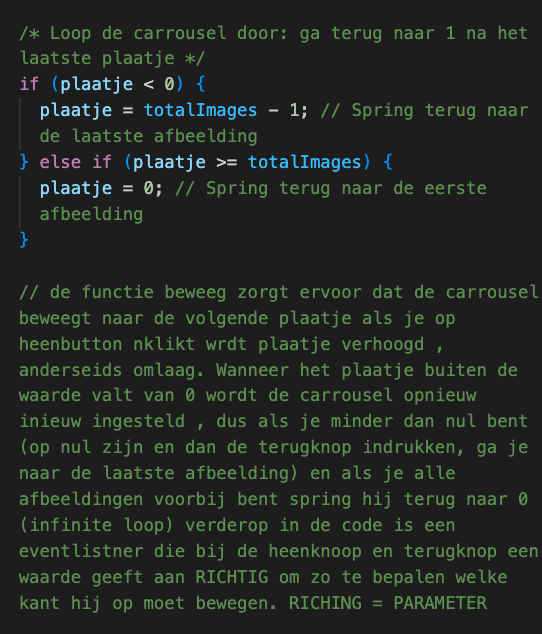

### Dit was lastig/Is niet gelukt:

Ik vond de stap van inleiding programeren en internet standaarden naar FED best wel groot, fed heeft mijn interesse naar code wel daadwerkelijk vergroot alleen had ik wel met sommige elementen dat ik dat erg lastig vond om te maken met de kennis die ik tot nu toe heb opgedaan. Wat niet is gelukt is de tekst in de carrousel krijgen en die dan te laten meedraaien. Ik zou misschien wat ideeen hebben hoe dit zou kunnen maar om dit zelf uit te werken vond ik nog erg lastig. hetzelfde was met tekst of plaatjes in een bepaalde afbeelding of grid te krijgen, ik probeerde het eerst zonder absolute positioning door bijvoorbeeld flexbox toe te passen op de elementen, nadat ik had aangegeven dat dit niet echt goed werkte mocht ik hier ook absolute positioning voor gebruiken waardoor het wel is gelukt, echter ben ik nog wel benieuwd of ik het zou kunnen laten werken. Het was een erg groot project dus voelde het soms alsof ik bijvoorbeeld voor dat soort dingen niet genoeg tijd had terwijl als ik er echt goed de tijd voor had kunnen nemen het waarschijnlijk zou kunnen werken. Ook zou ik nog iets strategischer willen leren coderen omdat ik nu begon en achteraf vak dingen nog moest aanpassen, bijvoorbeeld de custom properties wat dan veel onnodige tijd kost. Ook wil ik nog iets beter leren elementen psotioneren, voor de meeste elementen heb ik flex en grid gebruikt maar soms als ik bijvoorbeeld hele afzonderlijke elementen wil verplaatsen doe ik dit met marges en dat is soms niet de bedoeling.

En display flex op het halloween gedeelte lukt niet, omdat er al een display none opstaat en dan worden bepaalde items niet gepakt door de display flex ofzo, hier kwam ik niet echt uit.

  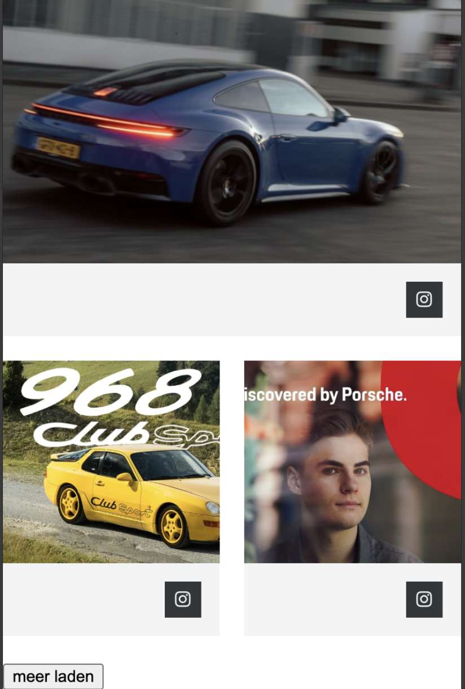

## Bronnenlijst

  
continu bijhouden terwijl je werkt

Nb. Wees specifiek ('css-tricks' als bron is bijv. niet specifiek genoeg).
Nb. ChatGpT en andere AI horen er ook bij.
Nb. Vermeld de bronnen ook in je code.

1. https://css-tricks.com/css-only-carousel/
2. https://www.nieknijland.nl/blog/make-a-responsive-carousel-with-just-css
3. https://blog.logrocket.com/build-image-carousel-scratch-vanilla-javascript/
4. Jason zijn doorgestuurde carrousel
5. Hoe loop je je carrousel - chat gpt
6. waar staat een $ voor bij parameters? - chat gpt
7. Chat gpt- Carrousel instructions
8. Absolute positioning - eloquent javascript (ja ik lees boeken)
9. Chat GPT – Om position relatief te zetten en vervolgens een absolute button erop te plaatsen.
   Geen specifieke website, dit is gegenereerde hulp van ChatGPT.
10. Chat GPT – Om position relatief te zetten en vervolgens een absolute button erop te plaatsen.
    Geen specifieke website, dit is gegenereerde hulp van ChatGPT.
11. MDN (Mozilla Developer Network) – Voor de object-fit: cover om afbeeldingen juist te schalen.
    https://developer.mozilla.org/en-US/docs/Web/CSS/object-fit
12. Chat GPT – Voor de positionering van elementen.
    Geen specifieke website, dit is gegenereerde hulp van ChatGPT.
13. CoPilot Carousels – Gebruikt voor het ontwerpen van carrousels.
    Geen specifieke lin
14. GRID Maker – Voor het verkrijgen van de juiste grid-template-columns.
    https://gridbyexample.com/
    https://cssgrid-generator.netlify.app/
15. Chat GPT – Voor het toevoegen van content voor een bepaald element zonder extra classes of divs.
    Geen specifieke website, dit is gegenereerde hulp van ChatGPT.
16. Jason's Carrousel op Codepen – Voor de carrousel .
    referentie naar Jason's werk.
17. GRID Maker – Gebruikt voor het ontwerpen van de social grid layout.
    https://gridbyexample.com/
    https://cssgrid-generator.netlify.app/
18. Chat GPT – Hulp gekregen bij het verbeteren van grids en aanvullende feedback.
    Geen specifieke website, dit is gegenereerde hulp van ChatGPT.
19. Chat GPT – Voor het afbreken van woorden zodat het overeenkomt met de website-indeling.
    Geen specifieke website, dit is gegenereerde hulp van ChatGPT.
20. Chat GPT – Voor het correct naast elkaar plaatsen van items met flexbox, inclusief geïmplementeerde screenshots.
    Geen specifieke website, dit is gegenereerde hulp van ChatGPT.
21. Chat GPT, MDM Button Appear, W3C Buttons – Voor het eenvoudig laten verdwijnen en verschijnen van knoppen zonder extra classes of divs.
    https://developer.mozilla.org/en-US/docs/Web/HTML/Element/button
    https://www.w3.org/TR/html50/forms.html#the-button-element
22. ChatGPT–Error verhelpen en controle of een element aanwezig is in de HTML voordat de functionaliteit wordt uitgevoerd.
    Geen specifieke website, gegenereerde hulp van ChatGPT.
23. ChatGPT–Idee om dynamisch een knop te maken die de video start of pauzeert.
    Gen specifieke website, gegenereerde hulp van ChatGPT.
24. ChatGPT–Voor het wisselen tussen afbeeldingen (Taycan en Cross Turismo) via knoppen.
    Geen specifieke website, gegenereerde hulp van ChatGPT.
25. ChatGPT–Code voor een prijschecker die de knoptekst aanpast tussen 'Bekijk prijs' en 'Verberg prijs' en de prijs toont/verbergt.
    Geen specifieke website, gegenereerde hulp van ChatGPT.
26. YouTube (Pastor Canayo-Sound buttons) en Farooq Dad–Ideeën om knoppen te gebruiken om geluiden af te spelen.
    Geen specifieke website.
27. MDN–Referentie voor de display: block eigenschap om elementen zichtbaar te maken.
    https://developer.mozilla.org/en-US/docs/Web/CSS/display
28. W3Schools–Voor het toggelen tussen light en dark mode met behulp van JavaScript en CSS.
    https://www.w3schools.com/howto/howto_js_toggle_dark_mode.asp
29. Daily Tuition (YouTube)–Voor een tutorial over het implementeren van light en dark mode.
30. https://www.codeguage.com/courses/js/touch-events-basics touch bewegingen
31. https://www.dhiwise.com/post/react-ontouchstart-enhancing-touch-interactivity-in-web-apps swiper javascript

